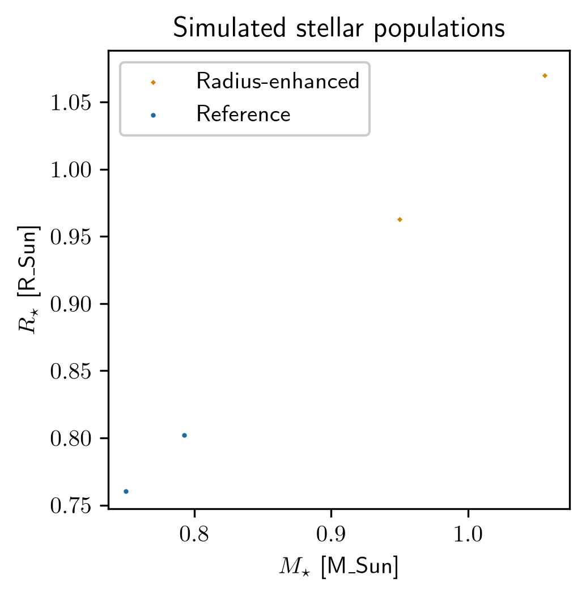

# Pergamon

Pergamon is a population-analysis and visualization package for astrophysical samples. Its scientific role is to take a population dictionary of sample properties, summarize the key features, visualize the one- and two-dimensional marginal distributions, and diagnose how those populations compare to one another.

## Scientific purpose

The package is intended for population-level analysis of astrophysical systems, including comparisons across samples, feature extraction, and diagnostic visualization of multi-dimensional parameter distributions. It is especially suited to checking whether samples differ in physically meaningful ways and produces summary plots that make the underlying population structure visible.

## Current ecosystem role

Within the active scientific stack, Pergamon sits in the population-analysis and visualization layer. It depends on the shared numerical and plotting utilities in `tdpy`, uses the same scientific-library conventions as the broader workflow stack, and provides a workflow layer for summarizing and comparing astrophysical populations rather than implementing low-level numerical primitives.

## Installation

```bash
cd pergamon
python -m pip install -e .
export PERGAMON_PATH=/path/to/pergamon
```

`PERGAMON_PATH` identifies the repository root. Keep runtime inputs in `data/` and generated pipeline outputs in `visuals/`; both directories are ignored by Git.

## Example workflow

The runnable example passes two deterministic simulated stellar samples through `pergamon.init(...)` and retains the pipeline's mass-radius comparison:

```bash
python examples/simulated_stellar_populations.py --typefileplot png
```



The reference sample spans 0.75 to 1.15 solar masses. The radius-enhanced sample spans 0.95 to 1.45 solar masses and follows a steeper deterministic mass-radius relation. Both populations are simulated inputs rather than observed stars. Pergamon constructs the common feature matrix and produces the displayed comparison through its standard population-plotting pipeline.

## Main modules

- `pergamon/main.py`: the core population-analysis workflow and plotting logic.
- `examples/`: executable population-visualization workflows and their generated figures.
- `tests/`: regression and import checks.

## Dependencies

The package uses the standard scientific stack and ecosystem utilities, including:

- `numpy`
- `pandas`
- `matplotlib`
- `tdpy`
- `ephesos`
- `miletos`
- `nicomedia`

## Output behavior

The package produces visual summaries of population properties and feature distributions. The important scientific objective is to make the population-level patterns visible to the researcher without forcing them to read the underlying implementation.

## Development status

Pergamon is maintained as a focused population-analysis workflow rather than a monolithic general-purpose repository. It is useful when used with the appropriate population dictionaries and feature conventions, and it should continue to rely on shared utility layers rather than duplicating low-level numerical functionality.

