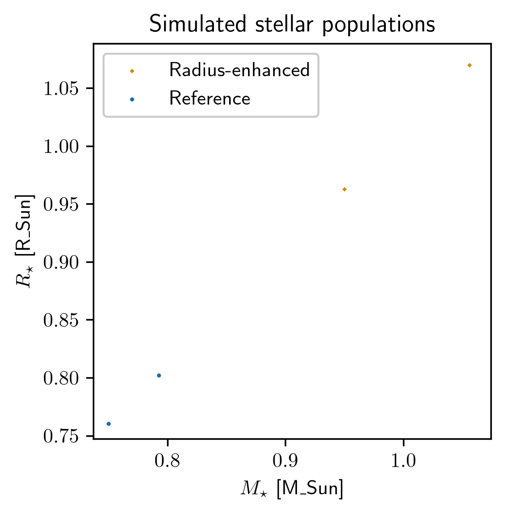

# Pergamon

Pergamon is a population-analysis and visualization package for astrophysical samples. Its scientific role is to take a population dictionary of sample properties, summarize the key features, visualize the one- and two-dimensional marginal distributions, and diagnose how those populations compare to one another.

## Purpose

The package is intended for population-level analysis of astrophysical systems, including comparisons across samples, feature extraction, and diagnostic visualization of multi-dimensional parameter distributions. It is especially suited to checking whether samples differ in physically meaningful ways and produces summary plots that make the underlying population structure visible.

## Population analysis

Pergamon compares astrophysical samples across measured or inferred properties, examines one- and two-dimensional distributions, identifies feature relationships, and generates summary figures that expose population differences.

## Occurrence rates

`pergamon.estimate_occurrence_rate(detected, detection_efficiency)` estimates the fraction of surveyed targets hosting an event. Provide one zero-or-one detection flag and one independently determined detection probability per target. For example, detections `[1, 0, 0]` and efficiencies `[1, 0.5, 0.5]` yield a maximum-likelihood occurrence fraction of about 0.67. These numbers illustrate the calculation and are not observational results. `pergamon.log_likelihood_occurrence_rate` evaluates the same model for posterior inference.

The calculation assumes at most one event per target, independent targets, known detection efficiencies, and no false positives. Classification alone does not establish detection efficiency. `pergamon.partition_classified_population` groups relevant and irrelevant targets by positive and negative classifications, including true and false positives and negatives, without inferring an occurrence rate from those groups.

For compact-object companion populations, `pergamon.compute_photometric_signatures` predicts Doppler beaming, ellipsoidal variation, and self-lensing amplitudes from orbital and stellar properties. `pergamon.derive_compact_object_features` also supplies transit duration, orbital scale, and Schwarzschild radius. These are model-derived features rather than detections or survey completeness measurements.

## Installation

```bash
cd pergamon
python -m pip install -e .
export PERGAMON_PATH=/path/to/pergamon
```

`PERGAMON_PATH` identifies the repository root. Keep runtime inputs in `data/` and generated pipeline outputs in `visuals/`; both directories are ignored by Git.

## Example workflow

The runnable example passes two deterministic simulated stellar samples through `pergamon.init(...)` and retains the pipeline's mass-radius comparison:

```bash
python examples/simulated_stellar_populations.py --typefileplot png
```



The reference sample spans 0.75 to 1.15 solar masses. The radius-enhanced sample spans 0.95 to 1.45 solar masses and follows a steeper deterministic mass-radius relation. Both populations are simulated inputs rather than observed stars. Pergamon constructs the common feature matrix and produces the displayed comparison through its standard population-plotting pipeline.

## Dependencies

The package uses:

- `numpy`
- `pandas`
- `matplotlib`
- `tdpy`
- `ephesos`
- `miletos`
- `nicomedia`

## Output behavior

Pergamon produces marginal distributions, feature-pair comparisons, and population summary figures from measured or inferred sample properties.

